# crm-e

> A desktop app for tracking job applications, managing email outreach, and never losing track of who you've contacted.

Built with Tauri + React. Your data lives entirely on your machine — no cloud, no subscriptions.

---

## What it does

crm-e is a personal CRM for your job search. You track every application in one place, compose and send emails directly from the app, sync replies, and let AI summarise what stage each conversation is at.

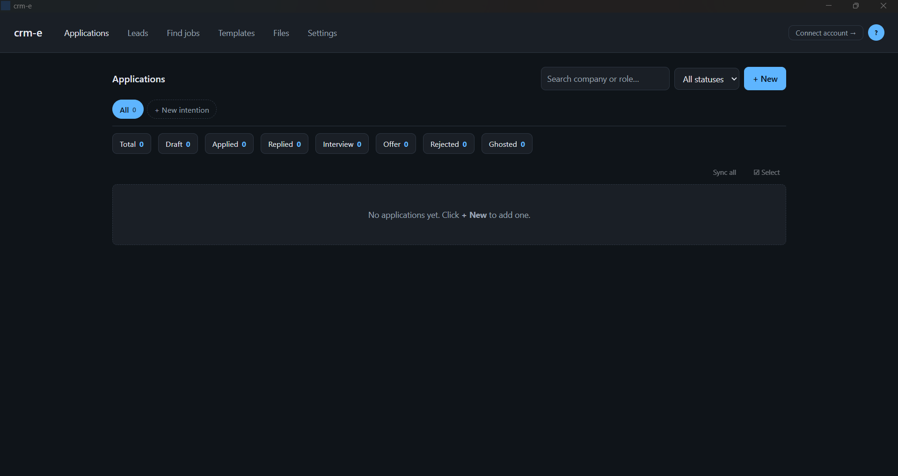

---

## Core features

| Feature | What it does |
|---|---|
| **Application tracking** | Log every company, role, contact, status, dates and notes |
| **Email compose** | Send templated emails directly via Gmail or Outlook |
| **Email sync** | Pull full reply threads back into the app |
| **AI analysis** | Classifies emails automatically — rejection, interview, offer |
| **AI draft** | Generate a full email draft with one click using OpenRouter |
| **Compose assist** | Context panel, AI Draft, both, or plain — your choice |
| **Templates** | Reusable email bodies and cover letters with live placeholders |
| **Cover letter PDF** | Generate and attach a PDF cover letter from a template |
| **File attachments** | Attach your CV, portfolio docs to outgoing emails |
| **Follow-up reminders** | Set a date — get a banner reminder when it's due |
| **Deadline alerts** | Pill in the table + bell notification when a deadline is 7 days or fewer away |
| **Notification bell** | Header badge showing due follow-ups and stale applications |
| **Views / Intentions** | Group applications by keyword, status, or label |
| **Leads** | Separate contact list for recruiters and networking |
| **Lead → Application** | Convert any contact into a draft application in one click |
| **Find jobs** | Built-in search of Arbetsförmedlingen listings, import as applications in one click |
| **Language toggle** | Switch the entire UI between English and Swedish |
| **Local storage** | Everything saved to SQLite on your own machine |

---

## Language toggle

The entire UI is available in English and Swedish. Click the **EN / SV** button in the top-right header to switch. The language preference is saved alongside your other settings and persists across restarts.

---

## Notification bell

A bell icon sits in the header next to your profile avatar. It shows a numbered badge whenever there is something worth acting on:

| Notification | Condition |
|---|---|
| 🔔 Follow-up due | An application has a follow-up date on or before today |
| ⏳ No response | An applied or replied application has had no contact in 30+ days |

Click the bell to open the dropdown. Each item links directly to the Applications tab. Individual notifications can be dismissed with ✕, or you can clear the whole list at once. Dismissed notifications reset when you restart the app — they reappear if the condition still holds.

---

## Leads

A separate contact list for recruiters, hiring managers and people worth following up with. Tag them, store their LinkedIn, track when you last reached out.

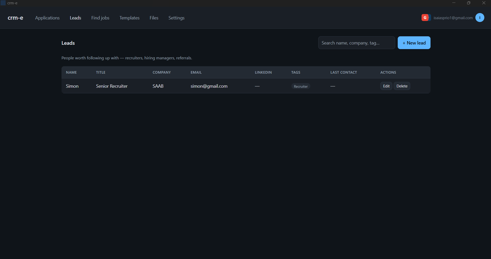

---

## Converting a lead to an application

Every row in the Leads table has a **→ Application** button. Clicking it creates a new draft application pre-filled with the contact's details:

| Lead field | Application field |
|---|---|
| Company | Company |
| Title | Role |
| Name | Contact name |
| Email | Contact email |
| LinkedIn URL | Job link |
| Notes | Notes |
| Last contact | Last contact |

The new application is created with status **Draft** and you are taken straight to the Applications tab so you can open it and start composing.

---

## Find jobs

Search Swedish job listings directly inside the app via the [Arbetsförmedlingen JobTech API](https://jobtechdev.se/) — no separate browser tab needed. Click `+` on any listing to import it as a draft application with the role, company and contact email pre-filled.

Filter by up to 4 role keywords, region, municipality, full-time / part-time, and remote. Pick how many results to show per page (20 / 50 / 100), and use the **Ladda fler** (Load more) button at the bottom to keep paging deeper through the results until you find what you want.

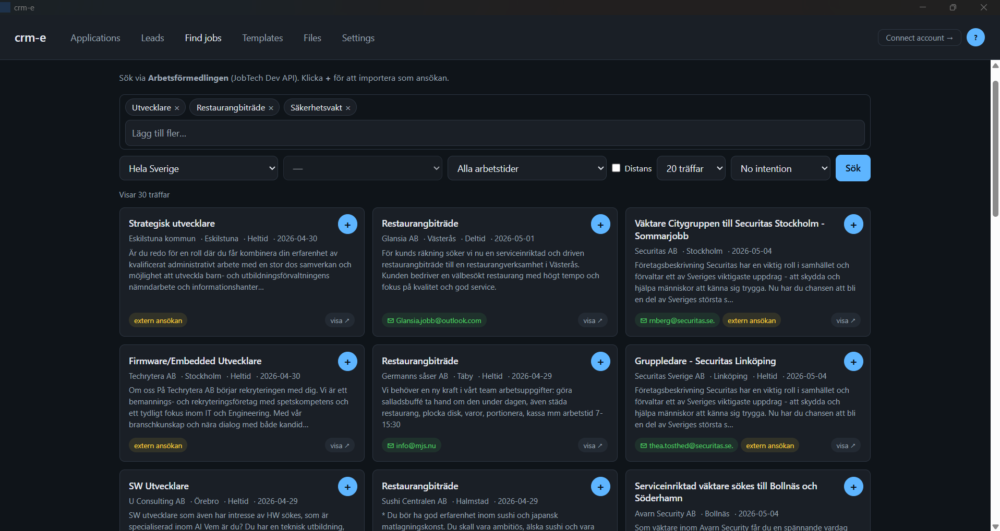

---

## Email providers

This is the most important thing to understand before setting up crm-e.

```
┌─────────────────────────────────────────────────┐
│               EMAIL PROVIDER STATUS             │
│                                                 │
│   ✅  OUTLOOK / MICROSOFT 365                  │
│       Available to every user                   │
│       No limits — sign in with any              │
│       Microsoft or work account                 │
│                                                 │
│   ⚠️  GMAIL                                    │
│       Limited to 100 users total               │
│       While Google OAuth review is pending     │
│       After approval → unlimited               │
│                                                 │
└─────────────────────────────────────────────────┘
```

### Why the Gmail limit?

crm-e sends email on your behalf using Google's official OAuth 2.0 flow — the same mechanism used by every reputable email client. Google requires apps that access Gmail to go through a verification process before they can serve more than 100 users. That review is in progress.

**What this means for you:**

```
Gmail early access (first 100 users)
─────────────────────────────────────
You log in → Google shows "unverified app" warning
You click "Continue anyway" → it works fully
All email stays in your actual Gmail inbox
Threading, replies, attachments — everything works

Gmail after the limit (user 101+)
───────────────────────────────────
Login is blocked until Google completes the review
Outlook works without any restrictions in the meantime
```

### Recommended setup

If you want to start right now with no friction, **connect Outlook**. It works for anyone, there is no review process, and the feature set is identical.

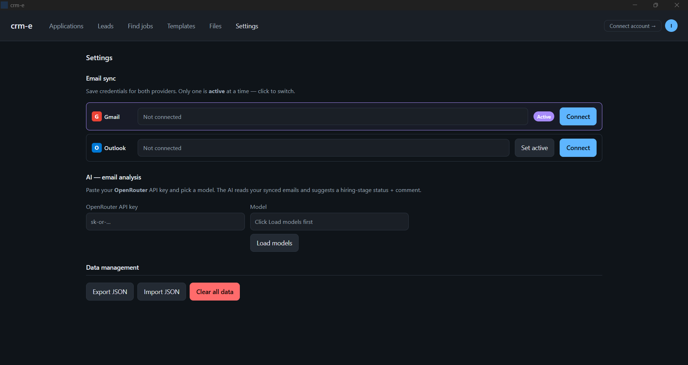

```
┌─────────────┐     OAuth PKCE      ┌──────────────────────┐
│             │ ──────────────────► │  Microsoft login page │
│   crm-e     │ ◄────────────────── │  (your browser)       │
│             │    access token     └──────────────────────┘
│  (desktop)  │
│             │   Microsoft Graph   ┌──────────────────────┐
│             │ ──────────────────► │  your Outlook inbox  │
│             │ ◄────────────────── │  send / sync / reply │
└─────────────┘                     └──────────────────────┘
```

---

## Views (Intentions)

Group your applications by purpose, not just by status. A **view** (also called an "intention") is a saved filter — for example *"Summer internships"* or *"Stockholm-based"*. Views can match automatically by:

- **Role keywords** — comma-separated, matches against the role title
- **Company keywords** — comma-separated, matches against the company name
- **Statuses** — only show apps in specific stages

Views appear as chips at the top of the Applications tab with live counts. Clicking a chip filters the table. You can also pin an application to a view manually using the per-row dropdown — useful for apps that don't match by keywords but still belong to that intention.

Imported jobs from the **Find jobs** tab inherit your currently selected intention, so you can search → import a batch → and they all land in the right view.

---

## The Applications table

The Applications view is more than a list — it has filtering, sorting and bulk actions:

- **Search** — type a company or role keyword in the top-right search box
- **Status filter** — dropdown next to search, narrow to a single status
- **Sort** — click any column header (Company / Role / Status / Applied / Last contact) to sort, click again to reverse
- **Status chips** — counters at the top show how many apps are in each status, scoped to the current view
- **Multi-select** — click **☑ Select** to enter selection mode, tick rows, then **Delete** to bulk-remove
- **↻ Sync all** — refreshes every tracked email thread across all applications in one click; the icon spins while syncing
- **Per-row actions** — Compose / Emails / Edit / Delete buttons on each row, plus a small G or O badge showing which provider that app is synced through

---

## Application lifecycle

Every application moves through a set of statuses. crm-e can suggest status changes automatically based on email content.

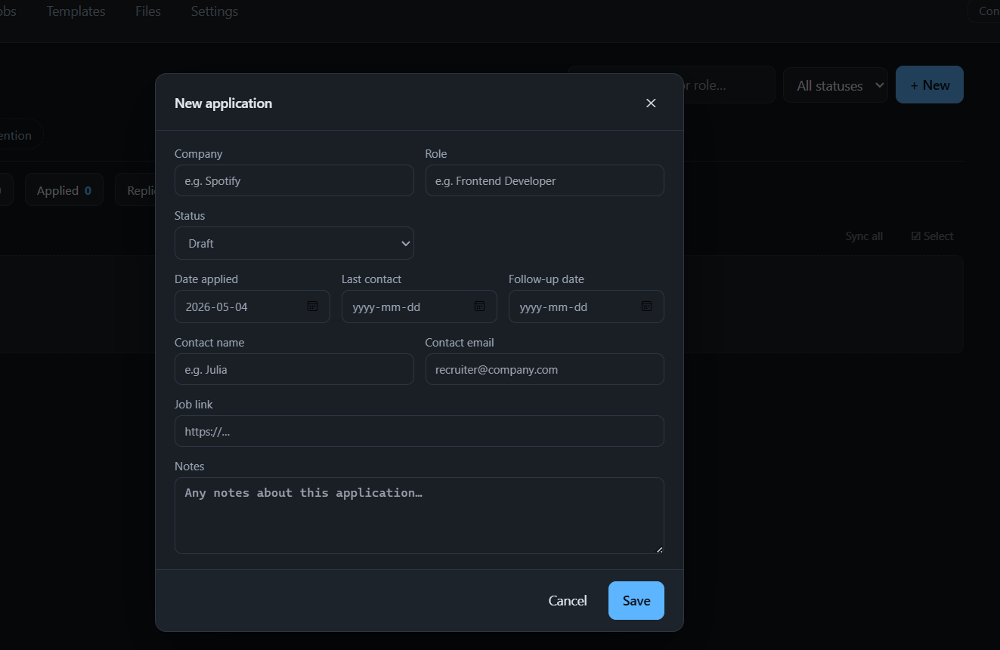

```
                       ┌─────────┐
                       │  DRAFT  │  ← you created it, haven't sent yet
                       └────┬────┘
                            │  send email via Compose
                            ▼
                       ┌─────────┐
                       │ APPLIED │  ← email sent, waiting for a reply
                       └────┬────┘
                            │  they reply
                            ▼
                       ┌─────────┐
                       │ REPLIED │  ← generic reply, no clear next step
                       └────┬────┘
               ┌────────────┼────────────┐
               ▼            ▼            ▼
         ┌──────────┐  ┌────────┐  ┌──────────┐
         │INTERVIEW │  │ OFFER  │  │ REJECTED │
         └──────────┘  └────────┘  └──────────┘

         GHOSTED ← set manually if no reply after your follow-up date
```

---

## How email sync works

```
You click "Sync from Outlook / Gmail"
           │
           ▼
crm-e fetches every message in the tracked thread(s)
           │
           ├── Stores full email body (not just a snippet)
           ├── Detects direction (sent by you vs received)
           └── Classifies each message:
                    │
                    ├── "offer"      → keywords: offer, employment agreement…
                    ├── "rejection"  → keywords: unfortunately, tyvärr, inte gå vidare…
                    ├── "interview"  → keywords: schedule, availability, Calendly…
                    └── "incoming"   → everything else from the other side

           │
           ▼
  If OpenRouter key is set → AI reads the full thread
           │
           ├── Suggests a status update
           └── Writes a 1-2 sentence summary of where things stand
```

---

## Replying inside the app

When you open an email thread, every message has a **↩ Reply** button. Click it and a reply panel opens at the bottom of the dialog with the same composer experience as a new email:

- Pick an **email template** to pre-fill the body — placeholders are substituted using the application context and your profile
- Pick a **cover letter** template and **Attach as PDF** to add a generated cover letter
- Toggle the **📎 Attach** panel to tick any uploaded file (CV, portfolio, etc.) to send along
- Replies are properly threaded — Gmail uses `In-Reply-To` / `References` headers, Outlook uses the `createReply` draft flow so attachments work on Microsoft 365 too
- Sending a reply automatically updates **Last contact** and clears any pending follow-up reminder

This means you can send a missing CV, follow up after an interview, or accept an offer without ever leaving crm-e.

---

## Templates and placeholders

Templates live under the **Templates** tab. You can write email templates and cover letters once and reuse them across every application.

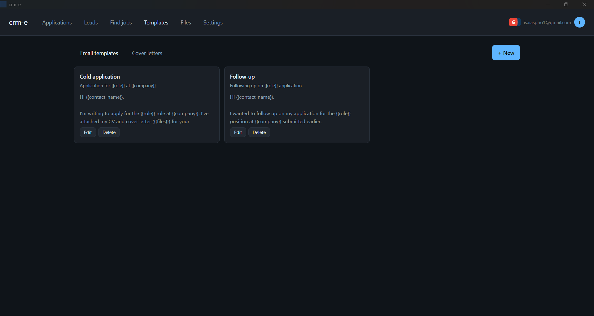

### Available placeholders

**Application data**
```
{{company}}       The company name
{{role}}          The job title
{{contact_name}}  Recruiter / hiring manager name
{{files}}         Names of attached files
```

**Your profile**
```
{{my_name}}       First name
{{my_last_name}}  Last name
{{my_full_name}}  Full name
{{my_email}}      Email address
{{my_phone}}      Phone number
{{my_address}}    Street, city, postal code, country
{{my_linkedin}}   LinkedIn URL
```

**Custom links** (set up in Profile → Custom links)
```
{{my_link_github}}     your GitHub URL
{{my_link_portfolio}}  your portfolio URL
{{my_link_dribbble}}   … and so on for every link you add
```

When you open Compose or Reply and pick a template, every `{{placeholder}}` is substituted with your real data before the email is sent.

---

## Cover letters

Cover letters are a special template type — they get their own editor and a live A4 preview as you type.

```
┌──────────────────────────────────────────────┐
│  Cover letter editor         │  A4 preview   │
│                              │               │
│  Hi {{contact_name}},        │  Hi Jane,     │
│                              │               │
│  I'm applying for the        │  I'm applying │
│  {{role}} role at            │  for the SWE  │
│  {{company}}…                │  role at Acme │
│                              │               │
│  [Attach as PDF] button ────────────────────►│
│                              │               │
└──────────────────────────────────────────────┘
```

Click **Attach as PDF** and the cover letter is generated with jsPDF and attached automatically to your outgoing email.

---

## Compose assist

When you open the Compose window, crm-e can show extra context or generate a draft for you. Choose your preferred mode under **Settings → Compose assist**:

| Mode | What you get |
|---|---|
| **Context panel** *(default)* | The compose dialog widens to show a left panel with the application's details — company, role, contact, status, dates, job link and notes — so you can write a tailored email without switching tabs |
| **AI Draft** | A `✨ AI Draft` button appears in the toolbar. Click it to generate a full subject + body using your OpenRouter model, tailored to the application's current stage |
| **Both** | Context panel on the left *and* the AI Draft button in the toolbar |
| **None** | Plain compose dialog, nothing extra |

### Context panel

The panel is always up to date with whatever is stored on the application — no extra steps needed. Empty fields (e.g. no deadline set) are automatically hidden so the panel stays clean.

### AI Draft

The AI is given the application's company, role, contact name, your name (from Profile), and a description of the current stage:

| Application status | Stage sent to AI |
|---|---|
| Draft | Initial outreach — has not yet applied |
| Applied | Polite follow-up on a pending application |
| Replied | Continuing a conversation the recruiter started |
| Interview | Thank-you or scheduling confirmation |
| Offer | Responding to an offer |
| Ghosted | Gentle final nudge after a long silence |

The generated subject and body are placed directly into the compose fields, fully editable before you send. The AI button is disabled if no OpenRouter key or model is configured, with a tooltip directing you to Settings.

---

## AI email analysis

crm-e integrates with [OpenRouter](https://openrouter.ai) so you can use any LLM to classify your email threads.

**Setup** (Settings → AI)
1. Create a free account at openrouter.ai
2. Generate an API key
3. Paste it into crm-e — pick any model (e.g. `mistralai/mistral-7b-instruct` is fast and cheap)

**What it does**
```
After every sync, if a key is configured:

Your email thread
       │
       ▼
┌─────────────────────────────────────────┐
│  AI reads the full conversation         │
│  (not just the latest message)          │
│                                         │
│  Returns:                               │
│    status  → draft / applied / replied  │
│              interview / offer /        │
│              rejected / ghosted         │
│                                         │
│    comment → 1-2 sentence summary       │
│              "They asked for a second   │
│               interview next Tuesday"   │
└─────────────────────────────────────────┘
       │
       ▼
crm-e shows a suggestion banner — you click Apply or Dismiss
```

No data is sent to Anthropic or any crm-e server. Your emails go directly from your machine to OpenRouter and back.

---

## File attachments

Upload your CV, portfolio, and other documents once under the **Files** tab. They are stored locally (as base64 in your database). When composing, tick the ones you want to attach — they are embedded in the MIME email and land in the recipient's inbox as regular file attachments.

Supported types: PDF, Word (.doc, .docx), images (JPEG, PNG, GIF, WebP), plain text.

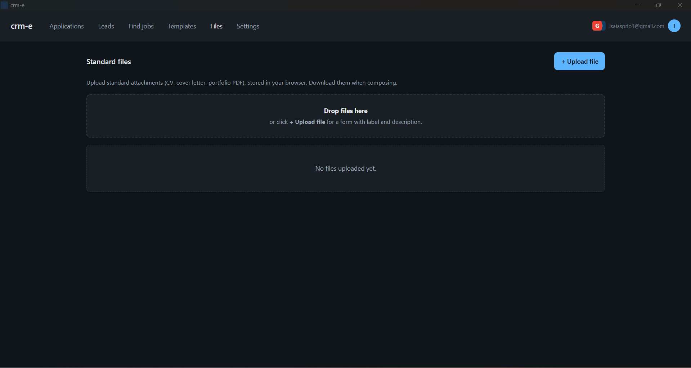

---

## Deadline alerts

Set an **Application deadline** on any application (in the Edit dialog). When the deadline is 7 days or fewer away, two things happen:

**In the Applications table** — a pill appears inline next to the company name:

| Pill | Meaning |
|---|---|
| 🟡 `3d left` | 3–7 days remaining |
| 🔴 `1d left` | 1–2 days remaining |
| 🔴 `Due today` | Deadline is today |

**In the notification bell** — a bell entry appears:

| Badge | Condition |
|---|---|
| 🟡 | Deadline in 3–7 days |
| 🔴 | Deadline today or in 1–2 days |

Deadline alerts are suppressed for applications already marked as Rejected, Ghosted, or Offer — they are only shown while the application is still active.

---

## Follow-up reminders

Set a **Follow-up date** on any application (in the Edit dialog). When that date arrives, a yellow banner appears at the top of the Applications tab:

```
⏰ Follow up with Spotify — Frontend Dev    [Open emails]  [Dismiss]
```

Sending or replying to an email automatically clears the reminder.

---

## Auto-updates

crm-e checks for new versions on launch. When one is available, a green banner appears at the top of the window:

```
Update 1.0.2 is available    [ Install & restart ]
```

Click **Install & restart** and the new version downloads, installs, and relaunches the app — no manual download or reinstall. Updates are signed with the same key that built the release, so the updater verifies them before applying.

---

## Backup and restore

Open **Settings → Data management** to back up or move your data:

- **Export JSON** — downloads a single `.json` file containing every application, template, file, lead, view, and your profile. Stored emails and OAuth tokens are included too
- **Import JSON** — replaces the current data with the contents of an exported file. Useful for moving between machines or restoring a backup
- **Clear all data** — wipes everything in the local database and reloads with seeded defaults (the two starter email templates)

Because everything lives in a single SQLite file you can also just copy `crm-data.db` directly between machines if you prefer file-level backups.

---

## Data storage

Everything is stored in a SQLite database on your own machine:

```
Windows   C:\Users\<you>\AppData\Roaming\com.crme.app\crm-data.db
macOS     ~/Library/Application Support/com.crme.app/crm-data.db
```

No account required. No data ever leaves your machine except the emails you explicitly send and the thread syncs you trigger. OAuth tokens are stored in the same local database.

---

## Getting started

1. Download the installer from the [Releases](https://github.com/1sa1asdev/crm-e/releases) page
2. Install and open crm-e
3. Go to **Settings** and connect Outlook (recommended) or Gmail
4. Go to **Profile** and fill in your name, phone, address and any custom links
5. Go to **Templates** and create your first email template
6. Go to **Applications** and click **+ New**

Once connected, your account appears in the top-right corner — click your avatar to jump to **Edit profile** or **Settings** anytime:

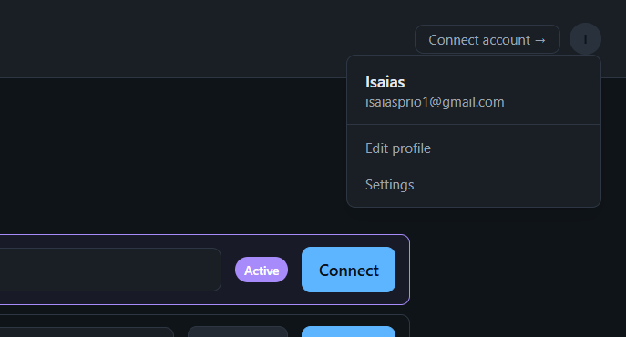

---

## Installing on Windows — bypassing SmartScreen

Because crm-e is not yet signed with a paid Microsoft certificate, Windows will show a SmartScreen warning the first time you run the installer. The app is safe — here is how to get past it:

1. Double-click the downloaded `.msi` or `.exe` installer
2. Windows shows **"Windows protected your PC"** — click **"More info"**

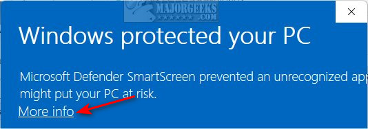

3. A **"Run anyway"** button appears — click it

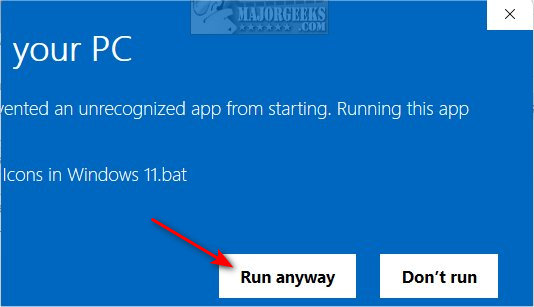

4. The installer proceeds normally

---

## Installing on macOS — bypassing Gatekeeper

macOS will block the app on first open because crm-e is not notarised with an Apple Developer certificate yet. Here is how to allow it:

1. Double-click the downloaded `.dmg` and drag crm-e to your Applications folder
2. Try to open crm-e — macOS will block it with a warning
3. Open **System Settings → Privacy & Security**
4. Scroll down to the **Security** section
5. You will see **"crm-e was blocked from use because it is not from an identified developer"** — click **"Open Anyway"**

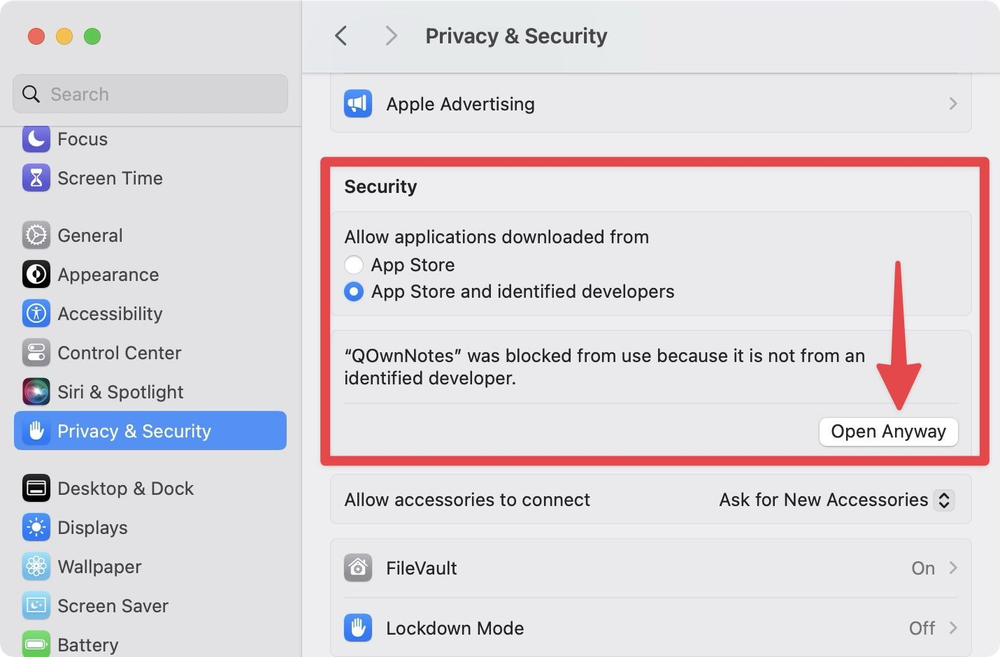

6. Confirm in the dialog that appears

> These warnings appear because code-signing certificates cost money and require annual renewal. crm-e is fully open source — you can read every line of code at [github.com/1sa1asdev/crm-e](https://github.com/1sa1asdev/crm-e) before running it.

---

## Tech stack

| Layer | Technology |
|---|---|
| Desktop shell | [Tauri 2](https://tauri.app) (Rust) |
| UI | React 18 + TypeScript + Vite |
| Styling | Tailwind CSS |
| Storage | SQLite via tauri-plugin-sql |
| Email (Gmail) | Gmail API — OAuth 2.0 PKCE |
| Email (Outlook) | Microsoft Graph API — OAuth 2.0 PKCE |
| AI | OpenRouter (any LLM, user-supplied key) |
| PDF generation | jsPDF |
| Auto-update | tauri-plugin-updater |
